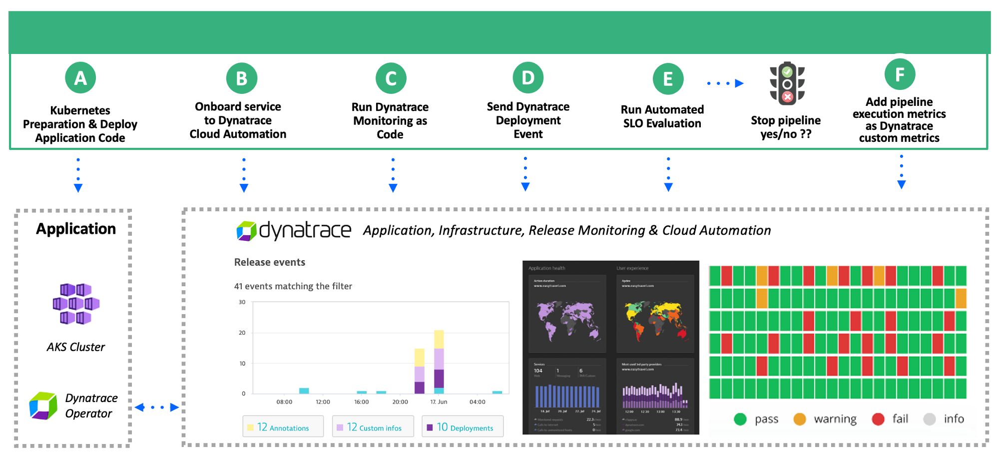

# Overview 

The folder contains a set of [GitHub actions](https://github.com/features/actions) workflows that showcase how to integrate Dynatrace into software delivery workflows within this representative pipeline.



| Step | Workflow Name | Comment |
| ---- | ------------------- | -------- |
| B | Keptn service onboarding | Demos this [image](https://github.com/keptn-sandbox/keptn-automation) that will onboard a demo service to [keptn](https://www.keptn.sh). All supporting files are in the `keptn` subfolder.|
| C | Monaco | Demos the [Dynatrace Monitoring as Code](https://github.com/dynatrace-oss/dynatrace-monitoring-as-code) framework (a.k.a. monaco) using the [Monaco Runner](https://github.com/dynatrace-ace/monaco-runner).  All supporting files are in the `monaco` subfolder. |
| E | Keptn Automated SLO evaluation | Demos this [image](https://github.com/keptn-sandbox/keptn-automation) that will perform an automated SLO evaluation.   |
| F | Dynatrace GitHub Action | Demos this [GitHub Action](https://github.com/marketplace/actions/dynatraceaction) lets you send events [Dynatrace Custom metrics](https://www.dynatrace.com/news/blog/simplify-observability-for-all-your-custom-metrics-part-2-oneagent-metric-api/) about the GitHub workflow executions | 
| A,D | Deploy All | Demos the the deployment of the [Dynatrace Orders Demo Application](https://github.com/dt-orders/overview) to an Azure Kubernetes cluster.  Also calls the Dynatrace GitHub Action to send deployment events to Dynatrace. All supporting files are in the `manifests` subfolder. |
| A,D | Deploy Order | Same as "Deploy All" workflow, but just deploys the "order" service. |

# Watch and learn more 

* Read more about this on this [Dynatrace 2 part Blog series](https://www.dynatrace.com/news/blog/how-dynatrace-and-github-help-you-deliver-better-software-faster/)

* This was demonstrated in this `Monitor and modernize Azure operations with Dynatrace webinar` you can watch on [YouTube](https://www.youtube.com/watch?v=nBs2P7Idtz0) starting at minute 25. 

# Demo Setup

Demo uses an Azure AKS cluster with Dynatrace SaaS tenant

1. [Dynatrace tenant](https://www.dynatrace.com/trial)

1. Ensure Azure subscription is correct with these commands
    ```
    az account list --output table
    az account set --subscription 123
    ```

1. Create AKS cluster
    ```
    export RESOURCE_GROUP=jahn-aks-demo
    export LOCATION=eastus
    az group create --location $LOCATION --name $RESOURCE_GROUP
    az aks create --location $LOCATION --resource-group $RESOURCE_GROUP --name $RESOURCE_GROUP \
    --node-count 2 --enable-addons monitoring --generate-ssh-keys
    ```

1. Once cluster is made, use the output of this command to get the value to use in AZURE_CREDENTIALS
    ```
    az ad sp create-for-rbac --name $RESOURCE_GROUP --role contributor \
    --scopes /subscriptions/$AZ_SUBSCRIPTION/resourceGroups/$RESOURCE_GROUP --sdk-auth
    ```

1. Once cluster is made, run the following commands
    ```
    kubectl create ns staging
    kubectl -n staging delete rolebinding default-view 
    kubectl -n staging create rolebinding default-view --clusterrole=view --serviceaccount=staging:default
    ```

1. For the local kubectl config, run this command to set credentials
    ```
    az aks get-credentials --resource-group $RESOURCE_GROUP --name $RESOURCE_GROUP
    ```

1. Install [Dynatrace Operator](https://www.dynatrace.com/support/help/technology-support/cloud-platforms/kubernetes/)

1. Create Dynatrace API token with these permissions
    * V1: read/write config, access problem/event feed 
    * V2: SLO read/write

1. Dynatrace Cloud Automation Account

1. github secrets were setup that are referenced in the workflows
    * `AZURE_CREDENTIALS` - JSON output from `az ad sp create-for-rbac` command
    * `DT_API_TOKEN` - Dynatace API token
    * `DT_BASE_URL` - Dynatrace URL such as `https://abc.live.dynatrace.com`
    * `KEPTN_API_TOKEN` - Keptn API Token from Cloud Automation Account
    * `KEPTN_BASE_URL` -  Cloud Automation Account URL used by Bridge and API calls
